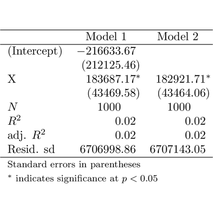

% Quant II Recitation
% Drew Dimmery <drewd@nyu.edu>
% January 31, 2014

# What is this?

- This presentation created using [knitr](http://yihui.name/knitr/) + [pandoc](http://johnmacfarlane.net/pandoc/) + [reveal.js](http://lab.hakim.se/reveal-js/)
- I have created a recitation repository on github: [https://github.com/ddimmery/Quant-II-Recitation](https://github.com/ddimmery/Quant-II-Recitation)
- This presentation is available at [https://github.com/ddimmery/Quant-II-Recitation/raw/master/2014-01-31/presentation.html](https://github.com/ddimmery/Quant-II-Recitation/blob/master/2014-01-31/presentation.html)

# Today's Topic

- Sharing is caring.
    - If you don't share your research (+ code and data) then what's the point of doing it?
- Today we will be discussing some necessary mechanics.
    - R and how to bend it to your will
    - Producing high quality tables / plots
    - If there's any time left, we can talk a little more about identification

# Sharing
- All homework will be submitted to me (preferably in hard copy)
- All replication code will be posted to a gist on github, and submitted to me via email.
    - [gist.github.com](https://gist.github.com/)
    - Code should have a header with relevant information (name, date created, date modified, input files, output files, etc)
    - **Code should be well commented**
    - If you'd prefer to submit homework as some sort of knitr document, that is also fine. Just submit the `.Rmd` file.
- All tables and plots should be of very high quality.
- Yes, this will take a non-trivial amount of time.

# Workflow
- Find an editor and learn everything about it:
    - **[vim](http://www.vim.org/)** (+ [Vim-R-plugin](http://www.vim.org/scripts/script.php?script_id=2628))
    - [emacs](http://www.gnu.org/software/emacs/) (+ [ESS](http://ess.r-project.org/) [Emacs Speaks Statistics])
    - [Notepad++](http://notepad-plus-plus.org/), [Kate](http://kate-editor.org/), [Sublime](http://www.sublimetext.com/), etc
    - **[Rstudio](http://www.rstudio.com/)**
    - [Eclipse](http://www.eclipse.org/) (+ [StatET](http://www.walware.de/goto/statet))
- Familiarize yourself with version control software
    - [git](http://git-scm.com/) ([github](https://github.com/) or [TortoiseGit](https://code.google.com/p/tortoisegit/))
    - or just [Dropbox](https://www.dropbox.com/)

# When things break
- Documentation - Ex: `?lm`
- [Google](http://google.com)
- CRAN (Reference manuals, vignettes, etc) - Ex: [http://cran.r-project.org/web/packages/AER/index.html](http://cran.r-project.org/web/packages/AER/index.html)
- JSS - Ex: [http://www.jstatsoft.org/v27/i02](http://www.jstatsoft.org/v27/i02)
- Stack Overflow - [http://stackoverflow.com/questions/tagged/r](http://stackoverflow.com/questions/tagged/r)
- Listservs - [http://www.r-project.org/mail.html](http://www.r-project.org/mail.html)

# Resources
- [The Art of R Programming](http://heather.cs.ucdavis.edu/~matloff/132/NSPpart.pdf) - N. Matloff
- [Modern Applied Statistics with S](http://www.stats.ox.ac.uk/pub/MASS4/) - W. Venables and B. Ripley
- [Advanced R Programming](http://adv-r.had.co.nz/) - forthcoming, H. Wickham
- [The R Inferno](http://www.burns-stat.com/documents/books/the-r-inferno/) - P. Burns
- [Rdataviz](https://github.com/pablobarbera/Rdataviz) - a talk by P. Barberá on ggplot2

# Reading R Documentation
- <a href="http://stat.ethz.ch/R-manual/R-patched/library/stats/html/lm.html" target="_blank">`?lm`</a>

# CRAN documentation
- <a href="http://cran.r-project.org/web/packages/AER/index.html" target="_blank">AER</a>

# JSS
- <a href="http://www.jstatsoft.org/v27/i02/">`plm`</a>

# Confusing Things
- At the prompt, > means you’re good to go, + means a parenthesis or bracket is open.
- Case sensitive
- Use / in path names. Not \\.
- R uses variables – there is no "sheet" here, like in Stata
- **R is a programming language**
- More on errors later!

# Using Third-party Code
- Relevant commands are: `install.packages` and `library`
- Find the appropriate packages and commands with Google and via searching in R:
```
?covariance
??covariance
install.packages("sandwich")
library("sandwich")
?vcovHC
```

# Data types
- Character - strings
- Double / Numeric - numbers
- Logical - true/false
- Factor - unordered categorical variables
- Objects - its complicated

# Character

. . .


```r
str <- "This is a string"
```


. . .


```r
paste("This", "is", "a", "string", sep = " ")
```

```
## [1] "This is a string"
```


. . .


```r
as.character(99)
```

```
## [1] "99"
```

```r
class(str)
```

```
## [1] "character"
```


# Numeric

. . .


```r
num <- 99.867
class(num)
```

```
## [1] "numeric"
```

. . .


```r
round(num, digits = 2)
```

```
## [1] 99.87
```


. . .


```r
round(str, digits = 2)
```

```
## Error: non-numeric argument to mathematical function
```


. . .


```r
pi
```

```
## [1] 3.142
```

```r
exp(1)
```

```
## [1] 2.718
```


- `sin`, `exp`, `log`, `factorial`, `choose`, `BesselJ`, etc

# Logical

- The logical type allows us to make statements about truth

. . .


```r
2 == 4
```

```
## [1] FALSE
```

```r
class(2 == 4)
```

```
## [1] "logical"
```


. . .


```r
str != num
```

```
## [1] TRUE
```


. . .


```r
"34" == 34
```

```
## [1] TRUE
```


- `==`, `!=`, `>`, `<`, `>=`, `<=`, `!`, `&`, `|`, `any`, `all`, etc

# Objects

- Many functions will return objects rather than a single datatype.

. . .


```r
X <- 1:100
Y <- rnorm(100, X)
out.lm <- lm(Y ~ X)
class(out.lm)
```

```
## [1] "lm"
```


- Objects can have other data embedded inside them

. . .


```r
out.lm$rank
```

```
## [1] 2
```

```r
class(out.lm$rank)
```

```
## [1] "integer"
```


# Data Structures

- There are other ways to hold data, though:

    - Vectors
    - Lists
    - Matrices
    - Dataframes

# Vectors

- Almost everything in R is a vector.

. . .


```r
as.vector(4)
```

```
## [1] 4
```

```r
4
```

```
## [1] 4
```


. . .

- We can combine vectors with `c`:

. . .


```r
vec <- c("a", "b", "c")
vec
```

```
## [1] "a" "b" "c"
```


. . .


```r
c(2, 3, vec)
```

```
## [1] "2" "3" "a" "b" "c"
```


# Vectors (cont.)

- Sometimes R does some weird stuff:

. . .


```r
c(1, 2, 3, 4) + c(1, 2)
```

```
## [1] 2 4 4 6
```


- It "recycles" the shorter vector:

. . .


```r
c(1, 2, 3, 4) + c(1, 2, 1, 2)
```

```
## [1] 2 4 4 6
```


. . .


```r
c(1, 2, 3, 4) + c(1, 2, 3)
```

```
## Warning: longer object length is not a multiple of shorter object length
```

```
## [1] 2 4 6 5
```


# More Vectors
- We can index vectors in several ways

. . .


```r
vec[1]
```

```
## [1] "a"
```


. . .


```r
names(vec) <- c("first", "second", "third")
vec
```

```
##  first second  third 
##    "a"    "b"    "c"
```


. . .


```r
vec["first"]
```

```
## first 
##   "a"
```


# Missingness

. . .


```r
vec[1] <- NA
vec
```

```
##  first second  third 
##     NA    "b"    "c"
```


. . .


```r
is.na(vec)
```

```
##  first second  third 
##   TRUE  FALSE  FALSE
```


. . .

```r
vec[!is.na(vec)]  # vec[complete.cases(vec)]
```

```
## second  third 
##    "b"    "c"
```


# Lists

- Lists are similar to vectors, but they allow for arbitrary mixing of types and lengths.

. . .


```r
listie <- list(first = vec, second = num)
listie
```

```
## $first
##  first second  third 
##     NA    "b"    "c" 
## 
## $second
## [1] 99.87
```


. . .


```r
listie[[1]]
```

```
##  first second  third 
##     NA    "b"    "c"
```

```r
listie$first
```

```
##  first second  third 
##     NA    "b"    "c"
```


# Matrices

- $$A = \begin{pmatrix}1 & 3\\ 2 & 4\end{pmatrix}$$
- $A_{ij}$
- $A_{1,2} = 3$
- $A_{1,\cdot} = (1,3)$

. . .


```r
A <- matrix(c(1, 2, 3, 4), nrow = 2, ncol = 2)
A
```

```
##      [,1] [,2]
## [1,]    1    3
## [2,]    2    4
```

```r
A[1, 2]
```

```
## [1] 3
```

```r
A[1, ]
```

```
## [1] 1 3
```


# Matrix Operations

- Its very easy to manipulate matrices:

. . .


```r
solve(A)  #A^{-1}
```

```
##      [,1] [,2]
## [1,]   -2  1.5
## [2,]    1 -0.5
```


. . . 


```r
10 * A
```

```
##      [,1] [,2]
## [1,]   10   30
## [2,]   20   40
```


. . .


```r
B <- diag(c(1, 2))
B
```

```
##      [,1] [,2]
## [1,]    1    0
## [2,]    0    2
```


. . .


```r
A %*% B
```

```
##      [,1] [,2]
## [1,]    1    6
## [2,]    2    8
```


# More Matrix Ops.

. . .


```r
A %*% diag(3)
```

```
## Error: non-conformable arguments
```


```r
t(A)  # A'
```

```
##      [,1] [,2]
## [1,]    1    2
## [2,]    3    4
```


. . .


```r
rbind(A, B)
```

```
##      [,1] [,2]
## [1,]    1    3
## [2,]    2    4
## [3,]    1    0
## [4,]    0    2
```


```r
cbind(A, B)
```

```
##      [,1] [,2] [,3] [,4]
## [1,]    1    3    1    0
## [2,]    2    4    0    2
```


. . .


```r
c(1, 2, 3) %x% c(1, 1)  # Kronecker Product
```

```
## [1] 1 1 2 2 3 3
```


# Naming Things

. . .


```r
rownames(A)
```

```
## NULL
```


. . .


```r
rownames(A) <- c("a", "b")
colnames(A) <- c("c", "d")
A
```

```
##   c d
## a 1 3
## b 2 4
```


. . .


```r
A[, "d"]
```

```
## a b 
## 3 4
```


- Matrices are vectors:

. . .


```r
A[3]
```

```
## [1] 3
```


# Dataframes

- The workhorse

- Basically just a matrix that allows mixing of types.

. . .


```r
data(iris)
head(iris)
```

```
##   Sepal.Length Sepal.Width Petal.Length Petal.Width Species
## 1          5.1         3.5          1.4         0.2  setosa
## 2          4.9         3.0          1.4         0.2  setosa
## 3          4.7         3.2          1.3         0.2  setosa
## 4          4.6         3.1          1.5         0.2  setosa
## 5          5.0         3.6          1.4         0.2  setosa
## 6          5.4         3.9          1.7         0.4  setosa
```


# Control Flow

- loops
- if/else
- functions
- useful stock functions to know

# Loops

- for loops - just a way to say "do this for each element of the index"
- "this" is defined in what follows the "for" expression

. . .


```r
for (i in 1:5) {
    cat(i * 10, " ")
}
```

```
## 10  20  30  40  50
```


. . .


```r
for (i in 1:length(vec)) {
    cat(vec[i], " ")
}
```

```
## NA  b  c
```


. . .


```r
for (i in vec) {
    cat(i, " ")
}
```

```
## NA  b  c
```


# If/Else

. . .


```r
if (vec[2] == "b") print("Hello World!")
```

```
## [1] "Hello World!"
```


. . .


```r
if (vec[3] == "a") {
    print("Hello World!")
} else {
    print("!dlroW olleH")
}
```

```
## [1] "!dlroW olleH"
```


# Vectorized If/Else

- Conditional execution on each element of a vector

. . .


```r
vec <- letters[1:3]
new <- vector(length = length(vec))
for (i in 1:length(vec)) {
    if (vec[i] == "b") {
        new[i] <- 13
    } else {
        new[i] <- 0
    }
}
new
```

```
## [1]  0 13  0
```


. . .


```r
new <- ifelse(vec == "b", 13, 0)
new
```

```
## [1]  0 13  0
```


# Functions

- $f : X \to Y$
- Functions in R are largely the same. ("Pure functions")

. . .


```r
add3 <- function(X) {
    return(X + 3)
}
add3(2)
```

```
## [1] 5
```


. . .


```r
makeGroups <- function(groups, members = 1) {
    return((1:groups) %x% rep(1, members))
}
makeGroups(5)
```

```
## [1] 1 2 3 4 5
```

```r
makeGroups(5, 2)
```

```
##  [1] 1 1 2 2 3 3 4 4 5 5
```


# Useful Functions

- Note: Most functions don’t do complete case analysis by default (usually option na.rm=TRUE)

- `print`, `cat`, `paste`, `with`, `length`, `sort`, `order`, `unique`, `rep`, `nrow`, `ncol`, `complete.cases`, `subset`, `merge`, `mean`, `sum`, `sd`, `var`, `lag`,`lm`, `model.matrix`,`coef`, `vcov`, `residuals`, `vcovHC` (from `sandwich`), `ivreg` (from `AER`), `countrycode` (from`countrycode`),`summary`, `pdf`, `plot`, Tools from `plm`, and many more.

# Distributional Functions

- `?Distributions`
- They have a consistent naming scheme.
- `rnorm`, `dnorm`, `qnorm`, `pnorm`
- `rdist` - generate random variable from dist
- `ddist` - density function of dist
- `qdist` - quantile function of dist
- `pdist` - distribution function of dist
- look at documentation for parameterization

. . .


```r
rnorm(16)
```

```
##  [1]  0.4597  2.2269  2.7330  0.4495 -0.2498  0.2645  0.4470  0.9376
##  [9]  1.3010  0.5880  1.3179  0.3703 -1.2490 -1.0140  1.3069 -1.4451
```


# Robust SEs
```{.r .numberLines}
robust.se <- function(model,cluster=1:length(model$residuals)) {
  require(sandwich)
  require(lmtest)
  M <- length(unique(cluster))
  N <- length(cluster)
  K <- model$rank
  dfc <- (M/(M - 1)) * ((N - 1)/(N - K))
  uj  <- apply(
               estfun(model),
               2,
               function(x) tapply(x, cluster, sum)
              )
  rcse.cov <- dfc * sandwich(model,meat = crossprod(uj)/N)
  rcse.se <- coeftest(model, rcse.cov)
  return(list(rcse.cov, rcse.se))
}
```

# Multiple Dispactch

- Sometimes functions will behave differently based on context:

. . .


```r
summary(vec)
```

```
##    Length     Class      Mode 
##         3 character character
```


. . .


```r
summary(c(1, 2, 3, 4))
```

```
##    Min. 1st Qu.  Median    Mean 3rd Qu.    Max. 
##    1.00    1.75    2.50    2.50    3.25    4.00
```


. . .


```r
summary(iris[, 1:4])
```

```
##   Sepal.Length   Sepal.Width    Petal.Length   Petal.Width 
##  Min.   :4.30   Min.   :2.00   Min.   :1.00   Min.   :0.1  
##  1st Qu.:5.10   1st Qu.:2.80   1st Qu.:1.60   1st Qu.:0.3  
##  Median :5.80   Median :3.00   Median :4.35   Median :1.3  
##  Mean   :5.84   Mean   :3.06   Mean   :3.76   Mean   :1.2  
##  3rd Qu.:6.40   3rd Qu.:3.30   3rd Qu.:5.10   3rd Qu.:1.8  
##  Max.   :7.90   Max.   :4.40   Max.   :6.90   Max.   :2.5
```


- Why? `?summary` `?summary.lm`
  
# The \*apply family

- These functions allow one to *efficiently* perform a large number of actions on data.
- `apply` - performs actions on the rows or columns of a matrix/array (1 for rows, 2 for columns, 3 for ??)
- `sapply` - performs actions on every element of a vector
- `tapply` - performs actions on a vector by group
- `replicate` - performs the same action a given number of times

# apply


```r
A
```

```
##   c d
## a 1 3
## b 2 4
```

```r
apply(A, 1, sum)
```

```
## a b 
## 4 6
```

```r
apply(A, 2, mean)
```

```
##   c   d 
## 1.5 3.5
```


# sapply


```r
vec
```

```
## [1] "a" "b" "c"
```

```r
sapply(vec, function(x) paste0(x, ".vec"))
```

```
##       a       b       c 
## "a.vec" "b.vec" "c.vec"
```

- Can be accomplished more simply with:

. . .


```r
paste0(vec, ".vec")
```

```
## [1] "a.vec" "b.vec" "c.vec"
```


- Why?

- `replicate` is basically just `sapply(1:N,funct)` where `funct` never uses the index.

# tapply


```r
tapply(1:10, makeGroups(5, 2), mean)
```

```
##   1   2   3   4   5 
## 1.5 3.5 5.5 7.5 9.5
```


# Working With Data

- Input
- Output

# Input

. . .


```r
setwd("~/github/Quant II Recitation/2014-01-31/")
dir()
```

```
## [1] "apsrtable.png"     "figure"            "iris.csv"         
## [4] "presentation.html" "presentation.md"   "presentation.Rmd" 
## [7] "reveal.js"         "stargazer.pdf"     "stargazer.png"
```

```r
iris <- read.csv("iris.csv")
```


- If data is, for instance, a Stata .dta file, use `read.dta` from the `foreign` package.

- Useful options for reading data: `sep`, `na.strings`, `stringsAsFactors`

- For different formats, Google it.

# Simulate some Data


```r
set.seed(1023)  # Important for replication
X <- rnorm(1000, 0, 5)
Y <- sin(5 * X) * exp(abs(X)) + rnorm(1000)
dat <- data.frame(X, Y)
plot(X, Y, xlim = c(0, 5), ylim = c(-50, 50))
```

 


# Regression Output


```r
dat.lm <- lm(Y ~ X, data = dat)
dat.lm
```

```
## 
## Call:
## lm(formula = Y ~ X, data = dat)
## 
## Coefficients:
## (Intercept)            X  
##     -216634       183687
```


# Regression Output


```r
summary(dat.lm)
```

```
## 
## Call:
## lm(formula = Y ~ X, data = dat)
## 
## Residuals:
##       Min        1Q    Median        3Q       Max 
## -2.10e+08 -4.19e+05  2.01e+05  8.17e+05  9.08e+06 
## 
## Coefficients:
##             Estimate Std. Error t value Pr(>|t|)    
## (Intercept)  -216634     212126   -1.02     0.31    
## X             183687      43470    4.23  2.6e-05 ***
## ---
## Signif. codes:  0 '***' 0.001 '**' 0.01 '*' 0.05 '.' 0.1 ' ' 1
## 
## Residual standard error: 6710000 on 998 degrees of freedom
## Multiple R-squared:  0.0176,	Adjusted R-squared:  0.0166 
## F-statistic: 17.9 on 1 and 998 DF,  p-value: 2.6e-05
```


# Pretty Output
- How do we get $\LaTeX$ output?
- The `xtable` package:

. . .


```r
require(xtable)
xtable(dat.lm)
```

```
## % latex table generated in R 3.0.2 by xtable 1.7-1 package
## % Tue Jan 28 18:00:20 2014
## \begin{table}[ht]
## \centering
## \begin{tabular}{rrrrr}
##   \hline
##  & Estimate & Std. Error & t value & Pr($>$$|$t$|$) \\ 
##   \hline
## (Intercept) & -216633.6722 & 212125.4622 & -1.02 & 0.3074 \\ 
##   X & 183687.1735 & 43469.5839 & 4.23 & 0.0000 \\ 
##    \hline
## \end{tabular}
## \end{table}
```


# xtable
- `xtable` works on any sort of matrix

. . .


```r
xtable(A)
```

```
## % latex table generated in R 3.0.2 by xtable 1.7-1 package
## % Tue Jan 28 18:00:20 2014
## \begin{table}[ht]
## \centering
## \begin{tabular}{rrr}
##   \hline
##  & c & d \\ 
##   \hline
## a & 1.00 & 3.00 \\ 
##   b & 2.00 & 4.00 \\ 
##    \hline
## \end{tabular}
## \end{table}
```


# xtable
- This is what `xtable` does with the `lm` object:

. . .


```r
class(summary(dat.lm)$coefficients)
```

```
## [1] "matrix"
```

```r
xtable(summary(dat.lm)$coefficients)
```

```
## % latex table generated in R 3.0.2 by xtable 1.7-1 package
## % Tue Jan 28 18:00:20 2014
## \begin{table}[ht]
## \centering
## \begin{tabular}{rrrrr}
##   \hline
##  & Estimate & Std. Error & t value & Pr($>$$|$t$|$) \\ 
##   \hline
## (Intercept) & -216633.67 & 212125.46 & -1.02 & 0.31 \\ 
##   X & 183687.17 & 43469.58 & 4.23 & 0.00 \\ 
##    \hline
## \end{tabular}
## \end{table}
```


- Note that this is the same as the output from `xtable(dat.lm)`

# Pretty it up

- Now let's make some changes to what `xtable` spits out:

. . .


```r
print(xtable(dat.lm, digits = 1), booktabs = TRUE)
```

```
## % latex table generated in R 3.0.2 by xtable 1.7-1 package
## % Tue Jan 28 18:00:20 2014
## \begin{table}[ht]
## \centering
## \begin{tabular}{rrrrr}
##   \toprule
##  & Estimate & Std. Error & t value & Pr($>$$|$t$|$) \\ 
##   \midrule
## (Intercept) & -216633.7 & 212125.5 & -1.0 & 0.3 \\ 
##   X & 183687.2 & 43469.6 & 4.2 & 0.0 \\ 
##    \bottomrule
## \end{tabular}
## \end{table}
```


- Many more options, see `?xtable` and `?print.xtable`

# apsrtable

- Read the documentation - there are many options.


```r
require(apsrtable)
dat.lm2 <- lm(Y ~ X + 0, data = dat)
apsrtable(dat.lm, dat.lm2)
```

```
## \begin{table}[!ht]
## \caption{}
## \label{} 
## \begin{tabular}{ l D{.}{.}{2}D{.}{.}{2} } 
## \hline 
##   & \multicolumn{ 1 }{ c }{ Model 1 } & \multicolumn{ 1 }{ c }{ Model 2 } \\ \hline
##  %            & Model 1      & Model 2     \\ 
## (Intercept)  & -216633.67   &             \\ 
##              & (212125.46)  &             \\ 
## X            & 183687.17 ^* & 182921.71 ^*\\ 
##              & (43469.58)   & (43464.06)   \\
##  $N$          & 1000         & 1000        \\ 
## $R^2$        & 0.02         & 0.02        \\ 
## adj. $R^2$   & 0.02         & 0.02        \\ 
## Resid. sd    & 6706998.86   & 6707143.05   \\ \hline
##  \multicolumn{3}{l}{\footnotesize{Standard errors in parentheses}}\\
## \multicolumn{3}{l}{\footnotesize{$^*$ indicates significance at $p< 0.05 $}} 
## \end{tabular} 
##  \end{table}
```


# apsrtable


```r
library(png)
library(grid)
img <- readPNG("apsrtable.png")
grid.raster(img)
```

 


# stargazer


```r
require(stargazer)
stargazer(dat.lm, dat.lm2)
```

```
## 
## % Table created by stargazer v.4.5.3 by Marek Hlavac, Harvard University. E-mail: hlavac at fas.harvard.edu
## % Date and time: Tue, Jan 28, 2014 - 18:00:20
## \begin{table}[!htbp] \centering 
##   \caption{} 
##   \label{} 
## \begin{tabular}{@{\extracolsep{5pt}}lcc} 
## \\[-1.8ex]\hline 
## \hline \\[-1.8ex] 
##  & \multicolumn{2}{c}{\textit{Dependent variable:}} \\ 
## \cline{2-3} 
## \\[-1.8ex] & \multicolumn{2}{c}{Y} \\ 
## \\[-1.8ex] & (1) & (2)\\ 
## \hline \\[-1.8ex] 
##  X & 183,687.000$^{***}$ & 182,922.000$^{***}$ \\ 
##   & (43,470.000) & (43,464.000) \\ 
##   & & \\ 
##  Constant & $-$216,634.000 &  \\ 
##   & (212,125.000) &  \\ 
##   & & \\ 
## \hline \\[-1.8ex] 
## Observations & 1,000 & 1,000 \\ 
## R$^{2}$ & 0.018 & 0.017 \\ 
## Adjusted R$^{2}$ & 0.017 & 0.016 \\ 
## Residual Std. Error & 6,706,999.000 (df = 998) & 6,707,143.000 (df = 999) \\ 
## F Statistic & 17.860$^{***}$ (df = 1; 998) & 17.710$^{***}$ (df = 1; 999) \\ 
## \hline 
## \hline \\[-1.8ex] 
## \textit{Note:}  & \multicolumn{2}{r}{$^{*}$p$<$0.1; $^{**}$p$<$0.05; $^{***}$p$<$0.01} \\ 
## \normalsize 
## \end{tabular} 
## \end{table}
```


# stargazer


```r
img <- readPNG("stargazer.png")
grid.raster(img)
```

 


# Both

- Both packages are good (and can be supplemented with `xtable` when it is easier)

- Get pretty close to what you want with these packages, and then tweak the $\LaTeX$ directly.

# Plotting
- It's all about coordinate pairs.
- `plot(x,y)` plots the pairs of points in `x` and `y`
- Notable options:
    - `type` - determines whether you plot points, lines or whatnot
    - `pch` - determines plotting character
    - `xlim` - x limits of the plot (likewise for `y`)
    - `xlab` - label on the x-axis
    - `main` - main plot label
    - `col` - color
    - A massive number of options. Read the docs.
- Some objects respond specially to `plot`. Try `plot(dat.lm)`

# Tying it Together

```r
x <- seq(-1, 1, 0.01)
y <- 3/4 * (1 - x^2)
plot(x, y, type = "l", xlab = "h", ylab = "weight")
```

 


# Tying it Together
- $W$ is an $n\times p$ diagonal weighting matrix, $h$ is a "bandwidth".
- Diagonal entries are $\frac{3}{4}\cdot(1-d^2)\cdot 1_{\{|d|\le 1\}}$ where $d = \frac{X-c}{h}$
- $\hat{\beta}_c = (X'WX)^{-1}X'WY$
- Covariance matrix is $s^2(X'WX)^{-1}$


```r
loc.lin <- function(Y, X, c = 0, bw = sd(X)/2) {
    d <- (X - c)/bw
    W <- 3/4 * (1 - d^2) * (abs(d) < 1)
    W <- diag(W)
    X <- cbind(1, d)
    b <- solve(t(X) %*% W %*% X) %*% t(X) %*% W %*% Y
    sigma <- t(Y - X %*% b) %*% W %*% (Y - X %*% b)/(sum(diag(W) > 0) - 2)
    sigma <- solve(t(X) %*% W %*% X) * c(sigma)
    return(c(est = b[1], se = sqrt(diag(sigma))[1]))
}
```


# Fit the Surface


```r
X.est <- seq(0, 5, 0.1)
dat.llm <- sapply(X.est, function(x) loc.lin(Y, X, c = x, bw = 0.25))
plot(X, Y, xlim = c(0, 5), ylim = c(-50, 50), pch = 20)
lines(X.est, dat.llm[1, ], col = "red")
lines(X.est, dat.llm[1, ] + 1.96 * dat.llm[2, ], col = "pink")
lines(X.est, dat.llm[1, ] - 1.96 * dat.llm[2, ], col = "pink")
```

 

